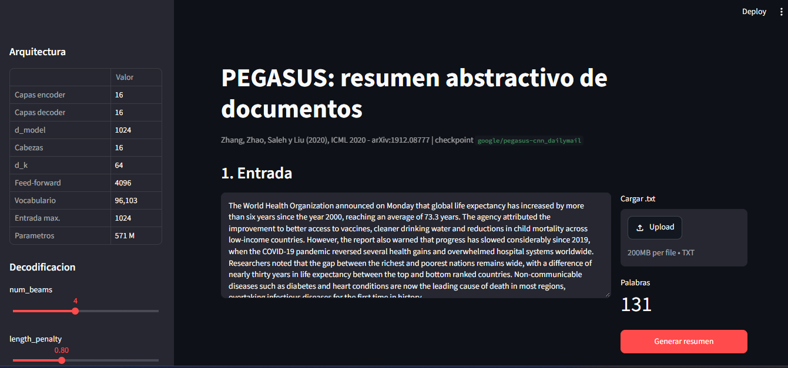
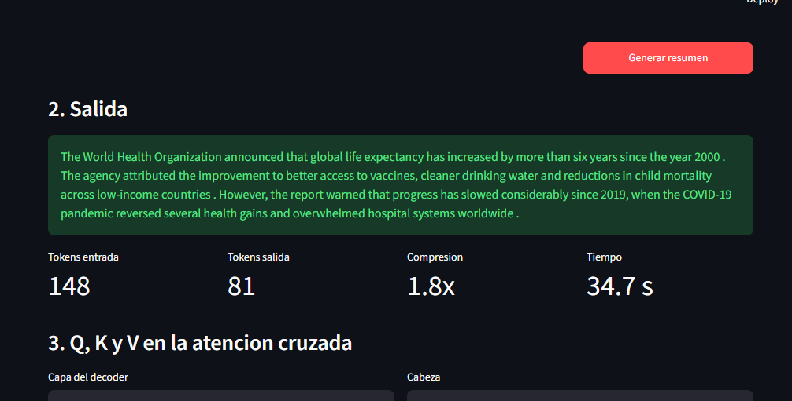
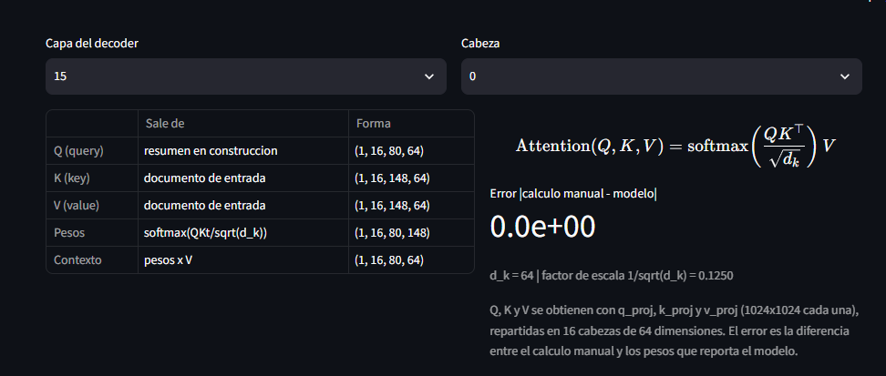
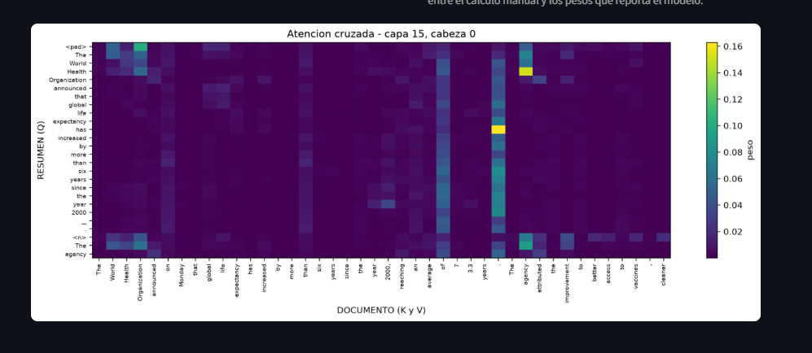

<p align="center">
  
</p>

<p align="center">
  <a href="https://www.python.org/"></a>
  <a href="https://pytorch.org/"></a>
  <a href="https://huggingface.co/google/pegasus-cnn_dailymail"></a>
  <a href="https://streamlit.io/"></a>
</p>

<p align="center">
  <strong>NLP · Transformers · Abstractive Summarization · Attention Interpretation · Q/K/V Analysis</strong>
</p>

> Academic NLP project focused on **abstractive text summarization**, **Transformer attention**, and the interpretation of **Q, K, and V** using the pretrained PEGASUS model.

**Master's in Artificial Intelligence and Data Analytics — Universidad Autónoma de Occidente**

## Project overview

**Portfolio focus:** this repository showcases hands-on work in NLP, Transformer architectures, model inference, attention interpretation, Python engineering, and Streamlit visualization.


This project implements inference with `google/pegasus-cnn_dailymail` and exposes it through an interactive **Streamlit** application.

Beyond generating summaries, the project inspects the decoder cross-attention mechanism by extracting the learned `q_proj`, `k_proj`, and `v_proj` projections, manually reconstructing:

```text
Attention(Q, K, V) = softmax(Q · Kᵀ / √d_k) · V
```

and comparing the result with the attention weights returned by the model.

In the documented test case, the manual calculation matches the model with a **maximum difference of 0.0 across all 16 decoder layers**.

## Why this project matters

This repository demonstrates practical work with:

- Natural Language Processing (NLP)
- Transformer encoder-decoder architectures
- Abstractive summarization
- PyTorch and Hugging Face Transformers
- Attention mechanism interpretation
- Q/K/V tensor analysis
- Streamlit application development
- Model inference and visualization

## Key results

| Metric | Result |
|---|---:|
| Input tokens | 148 |
| Output tokens | 81 |
| Compression | 1.8x |
| Local CPU inference time | 34.7 s |
| Decoder layers verified | 16 / 16 |
| Max. manual-vs-model attention difference | 0.0 |

> Runtime depends on the local hardware and software environment.

## Architecture

PEGASUS uses a Transformer encoder-decoder architecture. For the `google/pegasus-cnn_dailymail` checkpoint used in this project:

| Component | Value |
|---|---:|
| Encoder layers | 16 |
| Decoder layers | 16 |
| Model dimension | 1024 |
| Attention heads | 16 |
| Head dimension | 64 |
| Feed-forward dimension | 4096 |
| Vocabulary | 96,103 |
| Maximum input length | 1,024 tokens |
| Parameters | ~571M |

### Cross-attention

In decoder cross-attention:

- **Q (Query)** comes from the summary being generated.
- **K (Key)** comes from the source document.
- **V (Value)** comes from the source document.

The implementation uses forward hooks to capture the exact tensors entering the cross-attention modules. This is important because PEGASUS uses pre-layer normalization, so using the wrong hidden state produces a mismatch.

## Application

The Streamlit interface lets the user:

1. Enter or upload an English text document.
2. Generate an abstractive summary.
3. Inspect token counts, compression, and inference time.
4. Select a decoder layer and attention head.
5. Inspect Q, K, V, attention weights, and context tensor shapes.
6. Compare the manual attention calculation against the model.
7. Visualize cross-attention as a heatmap.

## Demo preview

The application combines summarization, model metrics, tensor inspection, manual attention verification, and an interactive cross-attention heatmap.

## Screenshots

### Input and architecture


### Summary, metrics, and Q/K/V shapes


### Q/K/V verification


### Cross-attention heatmap


## Repository structure

```text
.
├── app.py                      # Streamlit user interface
├── core.py                     # Model loading, inference, Q/K/V and attention logic
├── requirements.txt            # Python dependencies
├── tests/
│   └── prueba_humo.py          # Smoke test for attention reconstruction
├── capturas/                   # Execution evidence and screenshots
├── .github/workflows/
│   └── deploy.yml              # Dependency and Q/K/V validation workflow
└── .devcontainer/
    └── devcontainer.json       # Development container configuration
```

## Local setup

### Requirements

- Python 3.11 recommended for the documented Windows setup
- Sufficient disk space for the PEGASUS checkpoint (~2.2 GB)
- Internet access on the first execution to download the model

### Windows PowerShell

```powershell
git clone https://github.com/dilmergutierrez/Project_ProcesamientoDatosUAO.git
cd Project_ProcesamientoDatosUAO

py -3.11 -m venv .venv
.\.venv\Scripts\python.exe -m pip install -r requirements.txt
.\.venv\Scripts\python.exe -m streamlit run app.py --server.fileWatcherType none
```

Open:

```text
http://localhost:8501
```

### Linux / macOS

```bash
git clone https://github.com/dilmergutierrez/Project_ProcesamientoDatosUAO.git
cd Project_ProcesamientoDatosUAO

python -m venv .venv
source .venv/bin/activate
pip install -r requirements.txt
streamlit run app.py --server.fileWatcherType none
```

## Smoke test

To verify the attention reconstruction:

```powershell
.\.venv\Scripts\python.exe tests\prueba_humo.py
```

or on Linux/macOS:

```bash
python tests/prueba_humo.py
```

## Model

The project uses the pretrained checkpoint:

```text
google/pegasus-cnn_dailymail
```

The model is loaded with eager attention because recent versions of Transformers may use SDPA by default, which does not expose the attention weights required for this interpretation workflow.

## Limitations

- The selected checkpoint is designed for English text.
- Input is truncated at 1,024 tokens.
- CNN/DailyMail tends to produce relatively extractive summaries even though generation is abstractive.
- The current project does not report ROUGE over a complete benchmark test set.
- CPU inference can be slow because the checkpoint is large.

## Possible next steps

- Evaluate ROUGE on a test subset.
- Add a Lead-3 baseline for comparison.
- Measure novel n-grams to quantify abstractive behavior.
- Fine-tune or evaluate a model for Spanish.
- Add encoder and decoder self-attention visualizations.
- Package the project for a lightweight public demo.

## Academic context and contributors

This repository documents a collaborative academic project developed for **Procesamiento de Datos Secuenciales**.

Contributors:

- Andres David Bolaños
- Dilmer Gutierrez
- Eliana Ordoñez
- Eliana Vanessa Cardona Burbano

The repository is also used as part of Dilmer Gutierrez's technical portfolio to document the implementation, local execution, analysis, and learning outcomes from the project.

## References

1. J. Zhang, Y. Zhao, M. Saleh, and P. J. Liu, *PEGASUS: Pre-training with Extracted Gap-sentences for Abstractive Summarization*, ICML 2020. https://arxiv.org/abs/1912.08777
2. A. Vaswani et al., *Attention Is All You Need*, NeurIPS 2017.
3. C.-Y. Lin, *ROUGE: A Package for Automatic Evaluation of Summaries*, ACL 2004.
4. Google Research, PEGASUS repository: https://github.com/google-research/pegasus

---

### Portfolio keywords

`Python` · `NLP` · `Transformers` · `PEGASUS` · `PyTorch` · `Hugging Face` · `Streamlit` · `Attention` · `Machine Learning` · `Artificial Intelligence`
